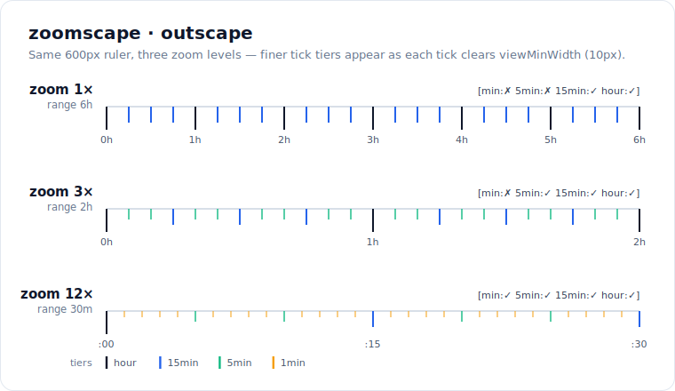

# zoomscape

English | [日本語](./readme.ja.md)

> Decide which scale-ruler units stay visible at a given zoom level / viewport width.

When you draw a ruler, grid, or timeline you usually have several tick tiers
(minute / 5-minute / hour / day …). As the user zooms out, the finer tiers get
too dense to read and should fade out. `outscape` answers, for each tier,
**"is there still enough room to show this?"** — a tiny, dependency-free
level-of-detail helper.



The same on-screen ruler at three zoom levels: each tier (hour → 15min → 5min →
1min) appears only once a single tick spans at least `viewMinWidth` pixels, so
finer marks reveal as you zoom in. `outscape` returns exactly that per-tier
`visibles` decision (shown on the right of each ruler).

## Install

```
$ npm install zoomscape
```

## Usage

```ts
import { outscape } from 'zoomscape'

const min = 60_000
const hour = 60 * min
const units = [min, 5 * min, 10 * min, 30 * min, hour]

// 8h range drawn across 1000px, hide anything thinner than 10px
outscape(units, 8 * hour, 1000, 10)
// => { visibles: [false, true, true, true, true] }   (minute tier fades out)

outscape(units, 8 * hour, 500, 10)
// => { visibles: [false, false, true, true, true] }  (minute + 5-minute fade)

outscape(units, 8 * hour, 10000, 10)
// => { visibles: [true, true, true, true, true] }     (zoomed in, all visible)
```

### API

```ts
outscape(
  units: number[],      // tier sizes in value-space (e.g. ms for a time ruler)
  range: number,        // total value range covered by the view
  viewWidth: number,    // view width in pixels
  viewMinWidth: number, // min pixels a tier must span to stay visible
): { visibles: boolean[] }
```

`visibles[i]` is `true` when `units[i] * (viewWidth / range) > viewMinWidth`.
The result array is aligned with the input `units`.

## Benchmark

`vitest bench` on Node, Apple Silicon — the function is a single `map`, so it is
effectively free:

| input       |        ops/sec | relative |
| ----------- | -------------: | -------: |
| 5 units     | ~10,700,000/s  |       1x |
| 1000 units  |    ~547,000/s  |   ~19.6x slower |

Run it yourself:

```
$ pnpm bench
```

## License

MIT © [anozon](https://anozon.me)
